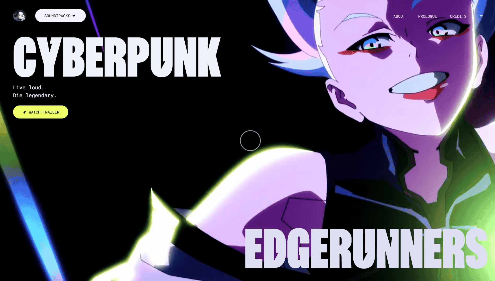

# Cyberpunk Edgerunners

<div align="center">



A futuristic React web application showcasing immersive design and interactive animations. Experience the cutting-edge world of Cyberpunk Edgerunners with smooth scroll animations, modern UI components, and responsive design.

[](https://react.dev)
[](https://vitejs.dev)
[](https://tailwindcss.com)
[](https://gsap.com)

</div>

---

## 📖 Table of Contents

- [Features](#features)
- [Tech Stack](#tech-stack)
- [Project Structure](#project-structure)
- [Getting Started](#getting-started)
- [Installation](#installation)
- [Available Scripts](#available-scripts)
- [Components](#components)
- [Configuration](#configuration)
- [Contributing](#contributing)
- [License](#license)

---

## ✨ Features

- **Stunning Animations**: Powered by GSAP and ScrollTrigger for smooth, performant animations
- **Responsive Design**: Fully responsive layout built with Tailwind CSS
- **Modern Architecture**: Built with React 19 and Vite for optimal performance
- **Interactive UI**: Dynamic navigation, hero sections, and engaging content displays
- **Optimized Performance**: Fast build times and minimal bundle size with Vite
- **Accessibility**: SEO-optimized with comprehensive meta tags
- **Video Integration**: Immersive multimedia content support

---

## 🛠️ Tech Stack

| Technology | Version | Purpose |
|-----------|---------|---------|
| **React** | 19.1.1 | UI Framework |
| **Vite** | 7.1.7 | Build Tool & Dev Server |
| **Tailwind CSS** | 4.1.16 | Styling & Design System |
| **GSAP** | 3.13.0 | Animation Library |
| **React Icons** | 5.5.0 | Icon Component Library |
| **React Use** | 17.6.0 | React Hooks Library |
| **ESLint** | 9.36.0 | Code Quality & Linting |

---

## 📁 Project Structure

```
CyberPunk/
├── public/
│   ├── audio/          # Audio assets
│   ├── fonts/          # Custom fonts
│   ├── img/            # Image assets (including cyberpunk.png)
│   └── videos/         # Video content
├── src/
│   ├── Components/
│   │   ├── About.jsx           # About section component
│   │   ├── AnimatedTitle.jsx   # Animated title component
│   │   ├── Button.jsx          # Reusable button component
│   │   ├── Contact.jsx         # Contact section component
│   │   ├── Features.jsx        # Features section component
│   │   ├── Footer.jsx          # Footer component
│   │   ├── Hero.jsx            # Hero section component
│   │   ├── NavBar.jsx          # Navigation bar component
│   │   ├── RoundedCorners.jsx  # Rounded corners component
│   │   ├── Story.jsx           # Story section component
│   │   └── VideoPreview.jsx    # Video preview component
│   ├── App.jsx         # Main application component
│   ├── index.css       # Global styles
│   └── main.jsx        # Application entry point
├── index.html          # HTML template
├── package.json        # Project dependencies
├── vite.config.js      # Vite configuration
├── eslint.config.js    # ESLint configuration
├── tailwind.config.js  # Tailwind CSS configuration
└── README.md           # This file
```

---

## 🚀 Getting Started

### Prerequisites

Ensure you have the following installed on your system:
- **Node.js** (v16 or higher)
- **npm** (v7 or higher) or **yarn**

### Installation

1. **Clone the repository** (if applicable)
   ```bash
   git clone https://github.com/yourusername/cyberpunk.git
   cd cyberpunk
   ```

2. **Install dependencies**
   ```bash
   npm install
   ```

3. **Start the development server**
   ```bash
   npm run dev
   ```

4. **Open in browser**
   The application will automatically open at `http://localhost:5173` (or the next available port)

---

## 📜 Available Scripts

### Development
```bash
npm run dev
```
Starts the Vite development server with hot module replacement (HMR). Perfect for development with instant feedback.

### Build
```bash
npm run build
```
Creates an optimized production build in the `dist` folder. The build is minified and ready for deployment.

### Preview
```bash
npm run preview
```
Previews the production build locally before deployment. Useful for testing the final build.

### Lint
```bash
npm run lint
```
Runs ESLint to check code quality and catch potential issues. Helps maintain code consistency and best practices.

---

## 🧩 Components Overview

### Core Components

| Component | Purpose |
|-----------|---------|
| **NavBar** | Navigation bar with responsive menu |
| **Hero** | Main hero section with eye-catching intro |
| **About** | About section with project information |
| **Features** | Showcases key features with animations |
| **Story** | Narrative section telling the project's story |
| **Contact** | Contact form and information section |
| **Footer** | Footer with links and copyright info |

### Utility Components

| Component | Purpose |
|-----------|---------|
| **AnimatedTitle** | Title component with animation effects |
| **Button** | Reusable button component |
| **RoundedCorners** | Component for rounded corner effects |
| **VideoPreview** | Video preview/player component |

---

## ⚙️ Configuration

### Vite Configuration
The `vite.config.js` includes:
- React plugin for JSX support
- Tailwind CSS Vite plugin for optimized builds
- Dev server configured to open automatically

### Tailwind CSS
Tailwind CSS is configured via the Vite plugin for optimal performance and development experience.

### ESLint
Code quality is maintained through ESLint configuration with:
- React best practices
- React hooks rules
- React refresh rules

### Meta Tags
The `index.html` includes comprehensive meta tags for:
- SEO optimization
- Open Graph tags for social media sharing
- Twitter Card support
- Theme color settings

---

## 🎨 Styling & Design

The project uses **Tailwind CSS** for styling, providing:
- Utility-first CSS approach
- Responsive design utilities
- Dark mode support
- Customizable theme configuration

Global styles are defined in `src/index.css`.

---

## 🎬 Animation System

The project leverages **GSAP** (GreenSock Animation Platform) with:
- **ScrollTrigger**: Scroll-based animations
- **Timeline**: Complex animation sequences
- **Easing functions**: Smooth motion dynamics
- **Performance optimization**: Hardware-accelerated animations

---

## 🔗 Social Media & Sharing

The project includes Open Graph and Twitter Card meta tags to ensure proper display when shared on social platforms:
- Preview image: `public/img/cyberpunk.png`
- Customizable title and description
- Proper domain configuration for og:url

---

## 📱 Browser Support

- Chrome (latest)
- Firefox (latest)
- Safari (latest)
- Edge (latest)

---

## 🚀 Deployment

### Build for Production
```bash
npm run build
```

### Deploy to Hosting Services

**Vercel:**
```bash
npm i -g vercel
vercel
```

**Netlify:**
```bash
npm i -g netlify-cli
netlify deploy --prod --dir=dist
```

**GitHub Pages:**
Update `vite.config.js` with your repository base path, then deploy the `dist` folder.

---

## 🤝 Contributing

Contributions are welcome! To contribute:

1. Fork the repository
2. Create a feature branch (`git checkout -b feature/AmazingFeature`)
3. Commit your changes (`git commit -m 'Add some AmazingFeature'`)
4. Push to the branch (`git push origin feature/AmazingFeature`)
5. Open a Pull Request

Please ensure your code follows the ESLint rules:
```bash
npm run lint
```

---

## 📝 Code Quality

- **Linting**: ESLint with React-specific rules
- **Code Style**: Consistent formatting with Prettier (optional)
- **Performance**: Optimized with Vite and React best practices

---

## 📦 Dependencies

### Core Dependencies
- `react@^19.1.1` - UI library
- `react-dom@^19.1.1` - React DOM rendering
- `vite@^7.1.7` - Build tool

### Animation & Design
- `gsap@^3.13.0` - Animation library
- `@gsap/react@^2.1.2` - GSAP React integration
- `tailwindcss@^4.1.16` - CSS framework
- `@tailwindcss/vite@^4.1.16` - Tailwind Vite plugin

### UI & Utilities
- `react-icons@^5.5.0` - Icon library
- `react-use@^17.6.0` - React hooks library

---

## 🐛 Troubleshooting

### Port Already in Use
If port 5173 is already in use, Vite will automatically use the next available port.

### Build Issues
- Clear the `node_modules` folder and `package-lock.json`
- Run `npm install` again
- Clear the `dist` folder

### Animation Not Working
- Ensure GSAP plugins are registered (ScrollTrigger, etc.)
- Check that CSS animations aren't conflicting
- Verify that scroll events are properly bound

---

## 📄 License

This project is licensed under the MIT License - see the LICENSE file for details.

---

## 👤 Author

Your Name - [@yourtwitter](https://twitter.com/yourtwitter)

---

## 🙏 Acknowledgments

- [GSAP Documentation](https://gsap.com)
- [React Documentation](https://react.dev)
- [Tailwind CSS](https://tailwindcss.com)
- [Vite Guide](https://vitejs.dev)
- The amazing Cyberpunk Edgerunners community

---

## 📞 Support

For support, email your-email@example.com or open an issue on GitHub.

---

<div align="center">

**Made with ❤️ and cutting-edge technology**

[⬆ Back to top](#cyberpunk-edgerunners)

</div>
